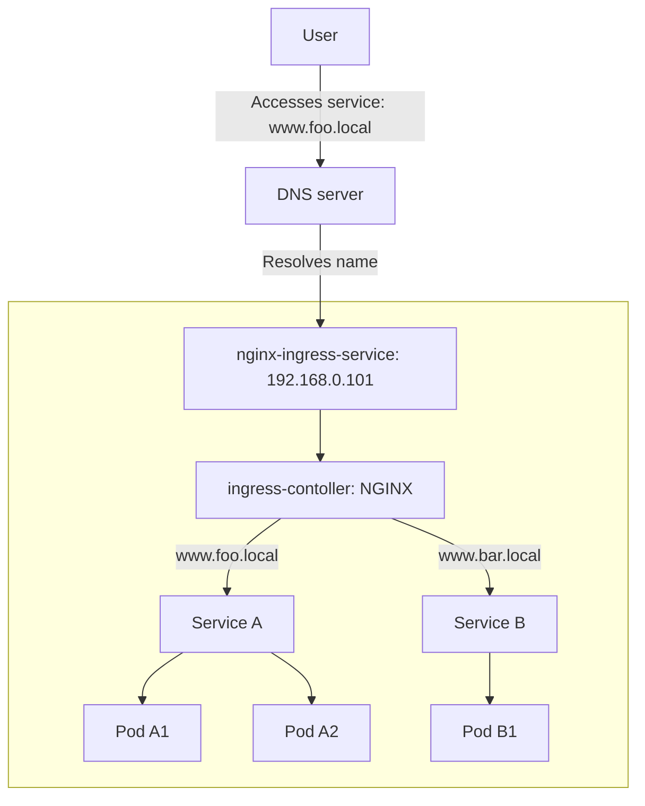

# Add addon <!-- omit in toc -->

Microk8s provides helpful addons that are able to be easily installed and removed.

## How to add an addon

Just run `microk8s enable <addon>`.

You can remove the addon whenever your like by running `microk8s disable <addon>`.

It is very easy!

## Addons

### dns

`dns` addon deploys CoreDNS that are used in the cluster so that pods in the cluster can connect with each other.

```sh
$ microk8s enable dns
```

### dashboard

`dashboard` addon deploys a standard Kubernetes Dashboard like the following picture.


You can get access to the dashboard from a remote host by running `microk8s dashboard-proxy` on Microk8s host.

### metallb

[metallb](https://microk8s.io/docs/addon-metallb) addon deploys a L4 load blancer named [MetalLB](https://metallb.universe.tf/).

MetalLB allows your bare-metal cluster to be IaaS-like(GCP, AWS, Azure…) network system.
You can assign your network address(e.g. 192.168.0.100) to your service on the cluster.

In Takeuchi Lab, the following IPs are assigned to the cluster services.

- DNS server: 192.168.0.100
- Web server: 192.168.0.101

### ingress

[ingress](https://microk8s.io/docs/ingress) addon deploys an nginx-ingress controller to your cluster.

You can use [Ingress](https://kubernetes.io/docs/concepts/services-networking/ingress/) resouce by enabling this addon.

Ingress handles HTTP(s) requets from outside to the cluster with virtual hosts.

Here is the system diagram.


